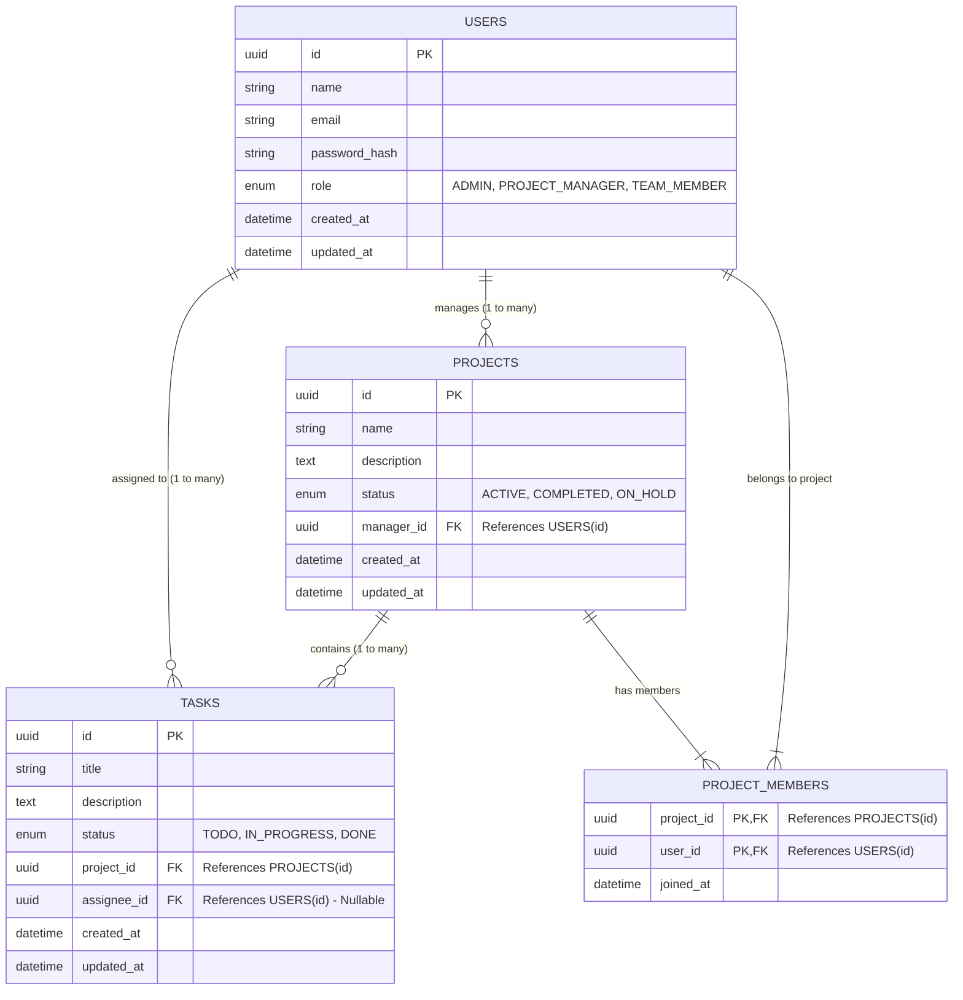

# Database Design & Architecture

Based on the frontend we just built and the requirements from your CyphLab assignment (MySQL/PostgreSQL, Role-based Access Control, Proper Relationships), here is the optimal, normalized relational database design.

## Entity Relationship Diagram (ERD)

This is the exact structure you should use for your assignment submission. It covers the core requirements (Administrator, Project Manager, Team Member).

## Relational Breakdown (SQL Tables)

Here is how you should structure your MySQL / PostgreSQL tables:

### 1. `users` Table
Handles secure authentication and role-based access control.
- `id`: UUID or Auto-increment INT (Primary Key)
- `name`: VARCHAR(255)
- `email`: VARCHAR(255) UNIQUE
- `password`: VARCHAR(255) *(Make sure to hash this using bcrypt in Node.js/Laravel!)*
- `role`: ENUM('ADMIN', 'PROJECT_MANAGER', 'TEAM_MEMBER')
- `created_at` / `updated_at`: TIMESTAMP

### 2. `projects` Table
Created by Managers or Admins.
- `id`: Primary Key
- `name`: VARCHAR(255)
- `description`: TEXT
- `status`: ENUM('ACTIVE', 'COMPLETED', 'ON_HOLD') Default: 'ACTIVE'
- `manager_id`: Foreign Key referencing `users(id)` *(This is the Project Manager who created it)*
- `created_at` / `updated_at`: TIMESTAMP

### 3. `project_members` Table (Pivot/Junction Table)
Because a user can be in many projects, and a project can have many users (Team Members), you **must** have this many-to-many junction table to get high marks for "Proper database relationships".
- `project_id`: Foreign Key referencing `projects(id)`
- `user_id`: Foreign Key referencing `users(id)`
- *Composite Primary Key*: `(project_id, user_id)`

### 4. `tasks` Table
Tasks belonging to a specific project.
- `id`: Primary Key
- `title`: VARCHAR(255)
- `description`: TEXT
- `status`: ENUM('TODO', 'IN_PROGRESS', 'DONE') Default: 'TODO'
- `project_id`: Foreign Key referencing `projects(id)` *(Cascade delete so if a project is deleted, its tasks are deleted)*
- `assignee_id`: Foreign Key referencing `users(id)` *(Nullable, because a task might not be assigned right away)*
- `created_at` / `updated_at`: TIMESTAMP

> [!TIP]
> **Assignment Advice**: This schema perfectly fulfills the CyphLab requirement for "Proper database relationships and validation". You can directly copy the Mermaid ER Diagram into your README.md or export it as an image for your final submission! 
